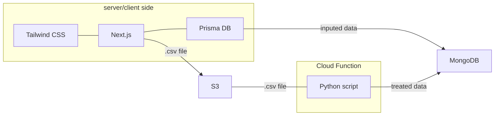
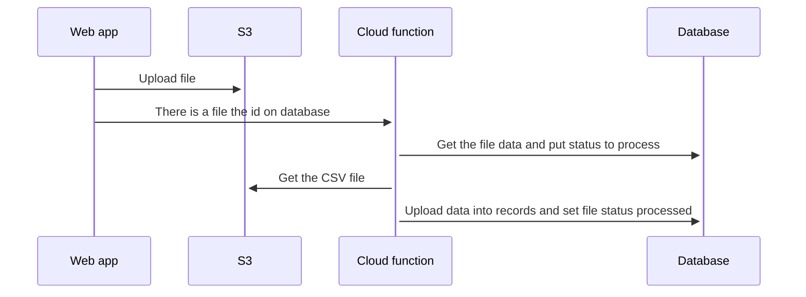

### Architectures

#### General vision

```mermaid
flowchart LR
    A["Tailwind CSS"]
    B["Prisma DB"]
    C["S3"]
    D["Python script"]
    E["MongoDB"]
    F["Next.js"]
    subgraph server/client side
    A
    B
    F
    end

    subgraph Cloud Function
    D
    end
    B--inputed data-->E
    F--.csv file-->C

    A --- F
    F --- B

    C--.csv file---D
    D--treated data-->E
```

#### Upload File Flux

```mermaid
sequenceDiagram
    Web app->>+S3: Upload file
    Web app->>+Cloud function: There is a file the id on database
    Cloud function->>+Database: Get the file data and put status to process
    Cloud function->>+S3: Get the CSV file
    Cloud function->>+Database: Upload data into records and set file status processed
```
